## WEB STACK IMPLEMENTATION (LEMP STACK)

### STEP 1 – INSTALLING THE NGINX WEB SERVER

NGINX web server is a high performance webserver that is used to display webpages to our sites. We will first update the server's package index before installation

`sudo apt update`

`sudo apt install nginx`

`sudo systemctl status nginx`

The last code above verifies that nginx has been sucessfully installed. Note that installation is sucessful if everythign is green as shown in below snapshot:
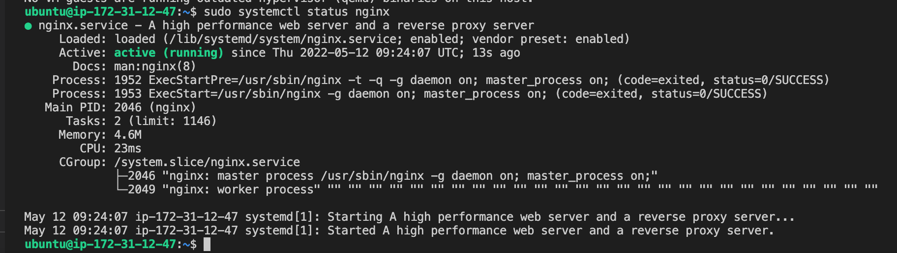

To acess the server locally from the internet (Source 0.0.0.0/0 means ‘from any IP address’), use below code;

`curl http://localhost:80`

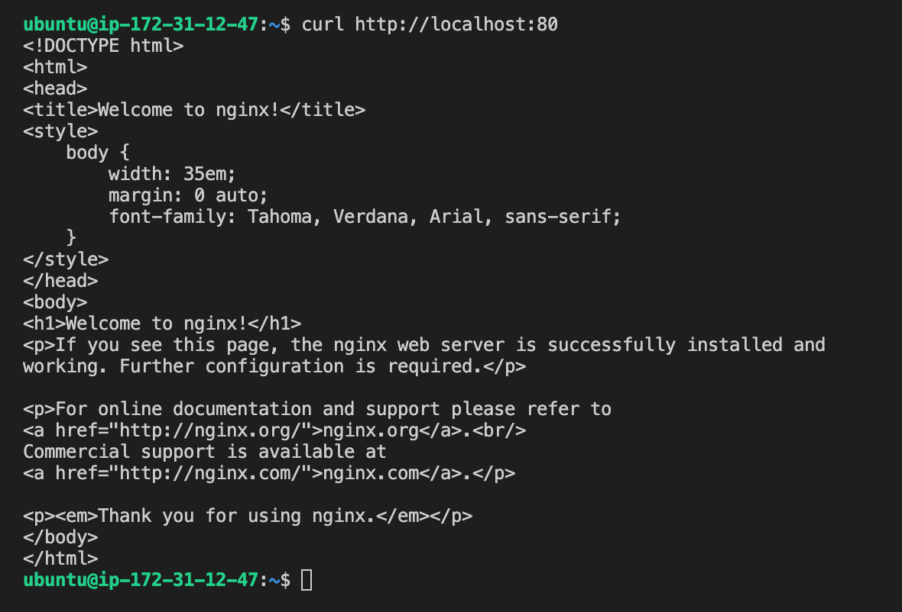

The next step is used to access the server from the internet. Use the code below in your internet broswer and dont forget to replace the ip address with the ip of your server;

`http://<Public-IP-Address>:80`

The result in the browswer is as follows:

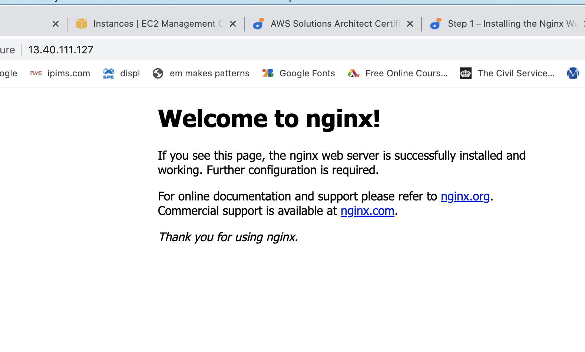

Another way of accessing the server from the command line is to use the curl command below. Ensure to replace the ip address with that of your server:

`curl -s http://169.254.169.254/latest/meta-data/public-ipv4`

The result in the command line is shown below:

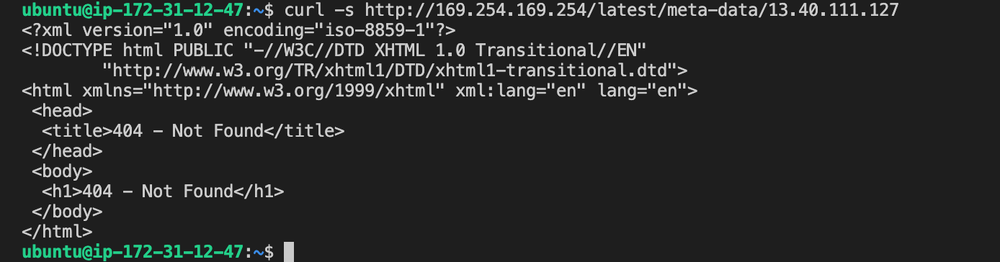

The above image shows an HTML representation of the result on the browser

### STEP 2 — INSTALLING MYSQL
After you have your webserver up and running, you need a database management system (DBMS) to store and manage data on the site. This is where MySQL comes in

To install mysql, run the following code:

`sudo apt install mysql-server`

Run the security script to remove insecure default settings:

`sudo mysql_secure_installation`

use the code below to verify that mysql has been installed correctly on your server:

`sudo mysql`

The result from my terminal is as follows:

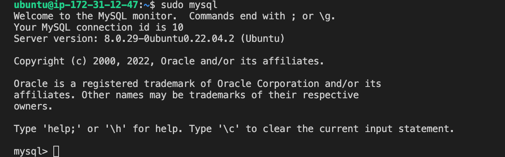

To exit MySql console, type the following:

`mysql> exit`

### STEP 3 – INSTALLING PHP

You have Nginx installed to serve your content and MySQL installed to store and manage your data. Now you can install PHP to process code and generate dynamic content for the web server.

You’ll need to install php-fpm, which stands for “PHP fastCGI process manager”, and tell Nginx to pass PHP requests to this software for processing. Additionally, you’ll need php-mysql, a PHP module that allows PHP to communicate with MySQL-based databases

use code below to install the packages:

`sudo apt install php-fpm php-mysql`

### STEP 4 — CONFIGURING NGINX TO USE PHP PROCESSOR

The Nginx server can be used to create server blocks which are similar to virtual hosts in Apache. This can be used to encapsulate configuration detials and host more than one domain on a single server

Here, instead of modifying  `/var/www/html`, we’ll create a directory structure within `/var/www` for the your_domain website, leaving `/var/www/html` in place as the default directory to be served if a client request does not match any other sites.

Create a directory for ProjectLEMP
`sudo mkdir /var/www/projectLEMP`

Assign ownership of the directory to reference the current user system

`sudo chown -R $USER:$USER /var/www/projectLEMP`

Use nano command line editor to opean a new configuration file in Ngnix's sites-available directory with the code below:

`sudo nano /etc/nginx/sites-available/projectLEMP`
Note that with above, a blankfile is created and the following configuration contents needs to be copied and saved into this blank file:

`#/etc/nginx/sites-available/projectLEMP

server {
    listen 80;
    server_name projectLEMP www.projectLEMP;
    root /var/www/projectLEMP;

    index index.html index.htm index.php;

    location / {
        try_files $uri $uri/ =404;
    }

    location ~ \.php$ {
        include snippets/fastcgi-php.conf;
        fastcgi_pass unix:/var/run/php/php7.4-fpm.sock;
     }

    location ~ /\.ht {
        deny all;
    }

}`

Press ctrl + x then  y and enter to save this configuration file in Nano

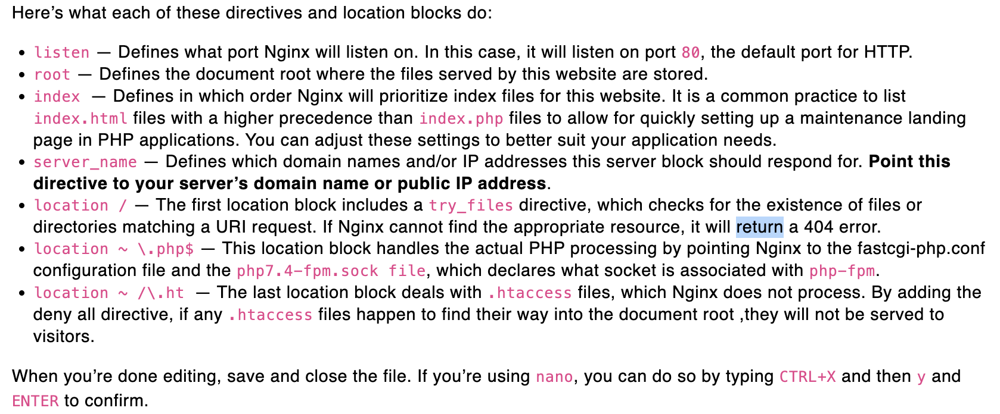

Activate the configuration by linking to the config file from Nginx’s sites-enabled directory:

`sudo ln -s /etc/nginx/sites-available/projectLEMP /etc/nginx/sites-enabled/`

Use the following to test the config file for errors:

`sudo nginx -t`

Below shows no erros and that config file is okay:

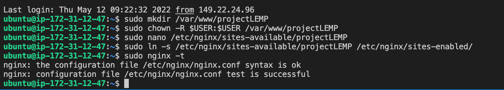

Use the following to disable the default Ngnix host that is currently configured to listen to port 80 by running below code:

`sudo unlink /etc/nginx/sites-enabled/default`

Then reload Ngnix and apply the changes with the following code:

`sudo systemctl reload nginx`

With the steps above, the new website is now active, but the web root /var/www/projectLEMP is still empty. Create an index.html file in that location so that we can test that your new server block works as expected:

`sudo echo 'Hello LEMP from hostname' $(curl -s http://169.254.169.254/latest/meta-data/public-hostname) 'with public IP' $(curl -s http://169.254.169.254/latest/meta-data/public-ipv4) > /var/www/projectLEMP/index.html`

Now, open the following in a web browser whilst taking care to enter the ip address of our EC2 instance:

`http://<Public-IP-Address>:80`

The site can also be accessed using the DNS server by running below code and taking care to replace the DNS server name with that of our EC2 server instance:

`http://<Public-DNS-Name>:80`

The result from my web browser is shown below:

You can leave this file in place as a temporary landing page for your application until you set up an index.php file to replace it. Once you do that, remember to remove or rename the index.html file from your document root, as it would take precedence over an index.php file by default.

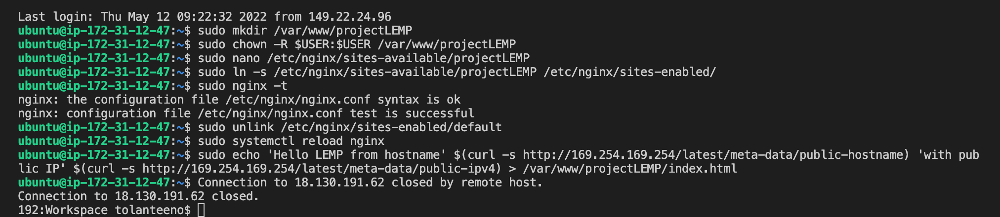

The LEMP stack is now fully configured. In the next step, we’ll create a PHP script to test that Nginx is in fact able to handle .php files within the newly configured website.

### STEP 5 – TESTING PHP WITH NGINX

Having fulling installed the LAMP stack, it should now be fully operational but it needs to be tested to ensure that Nginx can sucessfully hand .php files over to the PHP processor

A new file called info.php will be created within the document root in the nano text editor with the code below:

`sudo nano /var/www/projectLEMP/info.php`

The text below will be saved into this newly created file:

`<?php
phpinfo();`

This info.php file can now be accessed from the web browser using the code below taking care to replace the ip address with the EC2 instance IP address:

`http://`server_domain_or_IP`/info.php`

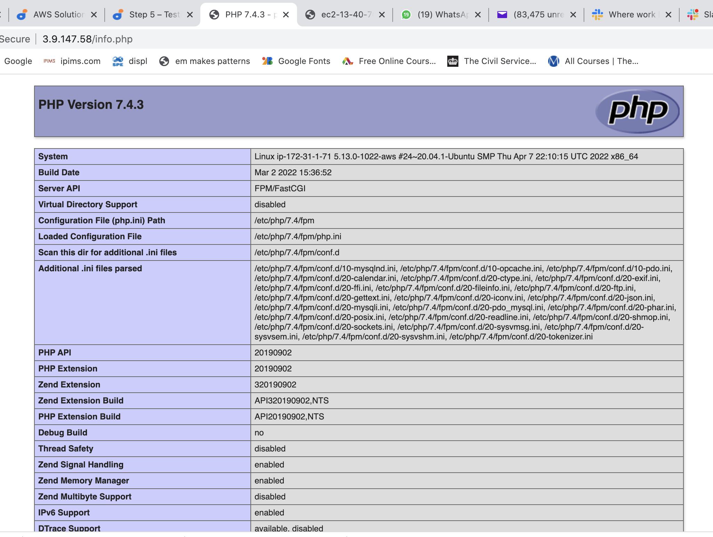

After checking for relevant information on this page, file containing php information can be removed for security reasons using the code below (the file can always be generated again):

`sudo rm /var/www/your_domain/info.php`

### STEP 6 – RETRIEVING DATA FROM MYSQL DATABASE WITH PHP (CONTINUED)

The task here is to create a test database with a simple to do list and configure access to it so that the Nginx website will be able to query data from the database and display it.

We’ll need to create a new user with the mysql_native_password authentication method in order to be able to connect to the MySQL database from PHP.

We will create a database named `example_database` and a user named `example_user`, but you can replace these names with different values.

Connect to the DB using the code below:

`sudo mysql`

Create a new DB by running the following code in the mysql console:

`CREATE DATABASE `example_database`;`

We will create a new user named example_user, using mysql_native_password as default authentication method. We’re defining this user’s password as password, but you should replace this value with a secure password of your own choosing.

`CREATE USER 'example_user'@'%' IDENTIFIED WITH mysql_native_password BY 'password';`

Give this user permission over the example_database database using the code below:

`GRANT ALL ON example_database.* TO 'example_user'@'%';`

The code above gives example_user full privileges over the example_database while preventing this user from creating or modifying other databases on my server

To test if the new user has the proper permissions by logging into Mysql console again, use the following code:

`mysql -u example_user -p`

The -p above prompts you to enter password that was created for the user

Below snapshot shows, all the code that have been run in step 6 thus far:

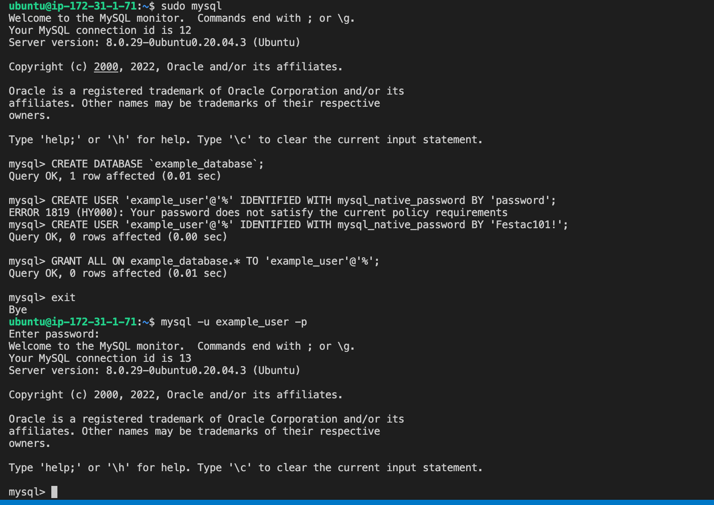

Run the code below in mysql console to confirm you have access to the example_database Database:

`SHOW DATABASES;`

The result is as follows:

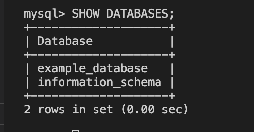

The next set of code is used to create a test table named todo_list in the mysql console:

`CREATE TABLE example_database.todo_list (item_id INT AUTO_INCREMENT, content VARCHAR(255), PRIMARY KEY(item_id));`

The code below is used to insert content into the table (do this a few times)

`mysql> INSERT INTO example_database.todo_list (content) VALUES ("My first important item");`

Use the code below to confirm that the entries into the table were done sucessfully:

`mysql>  SELECT * FROM example_database.todo_list;`

The result from my terminal console is as follows:

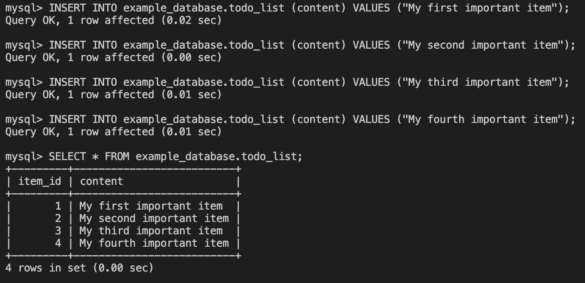

The code below is then used to exit mysql:

`mysql> exit`

The next step now is to connect to mysql with a php script that will query for the content of the database and display it on a web browser. Start by creating a PHP file in the custom web root directory using any prefered editor  (we will be using vi) with the code below:

`nano /var/www/projectLEMP/todo_list.php`

The script below is copied and saved into the new file called `todo_list.php`

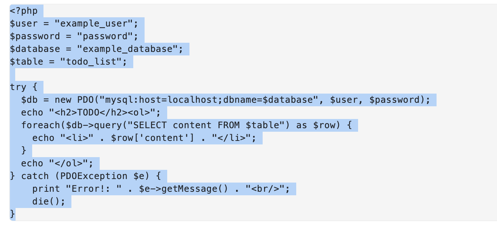

Note to change $password to the password that you created for example_user otherwise you wont be able to access the database. 

After saving and closing the php file, you can now use the code below to access the database from your web browser:

`http://<Public_domain_or_IP>/todo_list.php`

Note to use the ip address of the EC2 instance to view the php file in the web browser. The result is as follows:

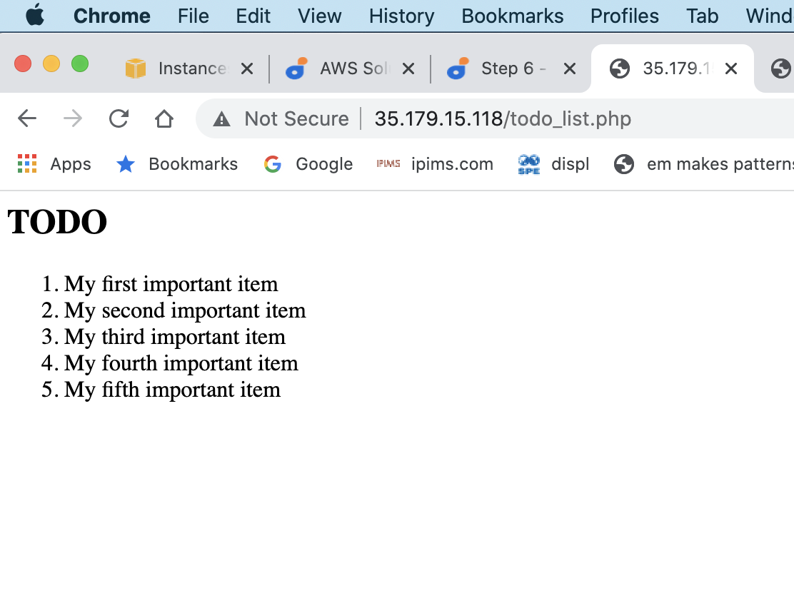

